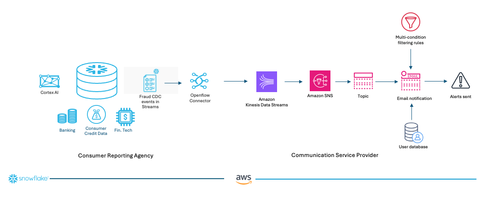

# Snowflake Openflow and Streams to AWS: Real-Time Fraud Alerting At Scale

*Discover how to build an enterprise-grade fraud detection pipeline that combines Snowflake's Change Data Capture (CDC) streams, AWS Kinesis, and intelligent email filtering to deliver instant, actionable fraud alerts while eliminating noise and false positives.*

---

## Overview

Imagine **SnoCreditGuard**, a leading consumer reporting agency that monitors over 200 million credit profiles, partnering with **AlertFlow Communications**, a specialized communication service provider. When SnoCreditGuard's AI and machine learning models detect suspicious activity—like a sudden spike in credit inquiries from unfamiliar locations—they need to instantly notify affected consumers without overwhelming them with false alarms.

The challenge: SnoCreditGuard processes 50+ million transactions daily in Snowflake, but only 0.02% warrant immediate consumer notification. Meanwhile, AlertFlow must deliver these critical alerts through multiple channels (email, SMS, push notifications) while maintaining 99.9% deliverability and sub-second latency.

This comprehensive guide demonstrates how to build the **production-ready fraud detection pipeline** that powers this partnership—a system that combines Snowflake's Change Data Capture (CDC) streams with AWS communication services to deliver **intelligent, personalized fraud alerts** that consumers actually need.

### Enterprise-Grade Capabilities:

- **Intelligent Risk Scoring**: Multi-dimensional analysis preventing alert fatigue by filtering 99.98% of routine transactions
- **Real-Time CDC Streaming**: Zero-copy change capture ensuring millisecond detection of suspicious patterns  
- **Adaptive Alert Routing**: Customer preference-aware delivery through optimal communication channels
- **Regulatory Compliance**: Comprehensive audit trails meeting FCRA and state privacy requirements
- **Scalable Infrastructure**: Auto-provisioned AWS resources handling traffic spikes during fraud events
- **Advanced Business Logic**: Sophisticated filtering based on customer risk profiles, account status, and behavioral patterns

## Architecture Overview

The system implements a sophisticated data pipeline that combines real-time streaming with intelligent business logic. The reference architecture below illustrates this demo pipeline.



### Key Components & Intelligence Layer:

1. **[Snowflake Streams](https://docs.snowflake.com/en/user-guide/data-pipelines-intro)** - Zero-copy change capture with exactly-once semantics
2. **[Snowflake Openflow](https://www.snowflake.com/en/product/features/openflow/)** - High-throughput data pipeline orchestration.
3. **[AWS Kinesis Data Streams](https://aws.amazon.com/kinesis/)** - Scalable, durable message queuing
4. **Intelligent Python Consumer** - Multi-condition filtering and business logic
5. **[AWS SNS](https://aws.amazon.com/sns/) with Email** - Reliable, scalable notification delivery


## Step-by-Step Implementation

### Step 1: Deploy AWS Infrastructure with CloudFormation

Assuming you already have an AWS account, preferably with administrator privileges, you can follow the guide below to deploy necessary resources.

**🚀 Quick Deploy**: 
Deploy the complete AWS infrastructure using the provided CloudFormation template. Simply click on this [link](https://console.aws.amazon.com/cloudformation/home#/stacks/new?stackName=Fraud-Detection-CDC&templateURL=https://snowflake-corp-se-workshop.s3.us-west-1.amazonaws.com/Openflow_fraud_detection_CDC/fraud-detection-infrastructure.yaml), fill in your email address, leave the default values unchanged, then click `Submit`. The template automatically provisions all necessary AWS resources and downloads the fraud detection demo files.

#### Parameters Required:
- **EmailAddress**: Your email address for fraud notifications (**Required** - no default)
- **InstanceType**: EC2 instance size (default: t3.micro)
- **KinesisStreamName**: Name for the Kinesis stream (default: fraud-detection-stream)
- **SNSTopicName**: Name for the SNS topic (default: fraud-detection-email-alerts)

In about 5 minutes, the following primary resources are deployed:

#### 🌐 **Resources Deployed**:

**Networking Infrastructure**
- Custom VPC with CIDR `10.0.0.0/16`
- Internet Gateway for external connectivity
- Public subnet with CIDR `10.0.1.0/24` in first AZ

**Compute & Storage**
- **`kinesis-consumer`** - EC2 instance (t3.micro) running Amazon Linux 2023 AMI in the public subnet
- Security group allowing only outbound traffic
- **`fraud-detection-stream`** - Kinesis Data Stream with:
  - 1 shard capacity
  - 24-hour retention period
  - KMS encryption enabled

**Identity & Access Management**
- IAM service role for Kinesis with limited permissions
- Attaches IAM role to EC2 instance for running Kinesis consumer

**Notification System**
- **`fraud-detection-email-alerts`** - SNS topic for fraud detection alerts
- Email subscription to SNS topic

#### 🔧 **Automated Setup Features**:
The CloudFormation template automatically:
- ✅ Downloads fraud detection demo files from S3
- ✅ Sets up Python environment with required dependencies
- ✅ Updates `customers.csv` with your provided email address
- ✅ Creates executable permissions for Python scripts
- ✅ Enables AWS Systems Manager Session Manager access


### Step 2: Set Up Snowflake Database and User for This Demo

In Snowflake, create a database, a schema, a role and a user. The role should have full privileges to the database, schema and the tables. Grant the role to the user and [configure key-pair authentication](https://docs.snowflake.com/en/user-guide/key-pair-auth), this will be used by the Openflow connector to log the user in.

### Step 3: Configure Openflow Data Pipeline
Assuming you have Openflow set up and a runtime ready for you to use. If not, please follow this [blog](https://medium.com/@rahul.reddy.ai/your-step-by-step-practical-guide-to-setting-up-snowflake-openflow-on-aws-byoc-07e5b7be5056) to set up Openflow first.

Download this [Openflow connector definition file](https://snowflake-corp-se-workshop.s3.us-west-1.amazonaws.com/Openflow_fraud_detection_CDC/Openflow_Fraud_detection_streams.json) and save it to your desktop. This connector is composed of two processors: [ConsumeSnowflakeStream](https://medium.com/r/?url=https%3A%2F%2Fdocs.snowflake.com%2Fen%2Fuser-guide%2Fdata-integration%2Fopenflow%2Fprocessors%2Fconsumesnowflakestream[) and [PutKinesisStream](https://medium.com/r/?url=https%3A%2F%2Fdocs.snowflake.com%2Fen%2Fuser-guide%2Fdata-integration%2Fopenflow%2Fprocessors%2Fputkinesisstream). The ConsumeSnowflakeStream processor listens for CDC events in the Snowflake Stream, then retrieves and puts them into the Kinesis Data Stream using the PutKinesisStream processor for downstream applications to consume.

On the Openflow canvas, create a process group and import the downloaded definition file, then fill in the required parameters.

#### Required Parameters:
- **Snowflake Account Name**: Your Snowflake account identifier
- **Snowflake User Name**: Snowflake database user with streams access
- **Snowflake Private Key**: Snowflake private key for key-pair authentication
- **Snowflake Key Passphrase**: Snowflake passphrase for the private key
- **Snowflake Database Name**: Snowflake database name
- **Snowflake Schema Name**: Snowflake schema name
- **Snowflake Role Name**: Snowflake role name
- **Snowflake Warehouse Name**: Snowflake warehouse
- **Snowflake Stream Name**: Snowflake stream where the CDC events will be held, `fraud_alerts_stream` is the default
- **AWS Access Key ID**: AWS access key for Kinesis access
- **AWS Secret Access Key**: AWS secret key for Kinesis access
- **AWS Kinesis Stream Name**: Kinesis stream name, `fraud-detection-stream` is the default


Now you can start the connector to stream data from Snowflake to Kinesis.


### Step 4: Configure SNS Email Subscriptions

Complete the email notification setup to receive fraud alerts.

#### 📧 **Email Subscription Process**:

1. **Check your email** for the SNS subscription confirmation
2. **Click the confirmation link** to activate notifications

#### 🔔 **Subscription Management**:
- Each email address must confirm subscription individually
- Multiple emails can subscribe to the same topic
- Unsubscribe options are included in every alert email


### Step 5: Connect to EC2 Instance Using Session Manager (AWS Console) and Launch the Kinesis Consumer

#### 1. Open AWS Management Console
- Log into [AWS Management Console](https://console.aws.amazon.com/)
- Navigate to **EC2 service**

#### 2. Find Your Instance named `kinesis-consumer`
- Click **"Instances"** in the left sidebar
- Locate and select your target instance

#### 3. Initiate Connection
- Click the **"Connect"** button at the top
- Connection dialog opens with multiple tabs

#### 4. Use Session Manager
- Click the **"Session Manager"** tab
- Your instance should appear in the list

#### 5. Connect
- Click **"Connect"** button
- New browser tab opens with terminal interface
- You're now connected to your EC2 instance

#### 6. Verify customer email configuration
Run the following command:

```bash
cd $HOME
cd fraud-detection
cat customers.csv
```

You should see the following configuration as sample customer information.
```csv
customer_id,first_name,last_name,email,phone_number,account_status,email_enabled,risk_level
CUST001,John,Snow,your.email@domain.com,+15551234567,ACTIVE,True,LOW
CUST002,Jane,Doe,jane.doe@techcorp.io,+15559876543,ACTIVE,True,MEDIUM
```

#### 7. Investigate the Python script to see the conditions for sending out email alerts:

```bash
cat kinesis_consumer_sns_email_alerts.py
```
The consumer implements sophisticated multi-condition filtering:

```python
# Email Alert Conditions (ALL must be met):
conditions = {
    'metadata_action': 'INSERT',           # Only new records
    'alert_status': '!= RESOLVED',         # Skip resolved cases
    'risk_score': '> 70',                  # Minimum risk threshold
    'risk_level': 'in [HIGH, CRITICAL]',   # High-priority only
    'customer_status': 'ACTIVE',           # Active accounts only
    'email_enabled': True                  # Customer opt-in required
}
```

#### 8. Launch the Kinesis Consumer

The consumer will perform the following tasks when started:

 - Listens for CDC events in the Kinesis stream
 - Inspects the events and applies multi-condition filtering. If the conditions are met, email alerts will be sent via SNS.

Now run the following command to launch the consumer:
```bash
python3 kinesis_consumer_sns_email_alerts.py
```

### Step 6: Simulate Fraud Events in Snowflake Streams

In Snowsight, execute the following SQL commands to create the fraud detection table and stream, then simulate fraud alert creation and trigger email notifications.

<div style="font-size: 12px;">

```sql
-- 1. Create fraud alerts table and investigate CDC event content
BEGIN
CREATE OR REPLACE TABLE fraud_alerts (
    alert_id VARCHAR(30) PRIMARY KEY,
    transaction_id VARCHAR(25) NOT NULL,
    customer_id VARCHAR(15) NOT NULL,
    alert_type VARCHAR(30) NOT NULL, -- HIGH_AMOUNT, FOREIGN_TRANSACTION, VELOCITY_SPIKE
    risk_score INTEGER NOT NULL,
    risk_level VARCHAR(10) NOT NULL, -- LOW, MEDIUM, HIGH, CRITICAL
    status VARCHAR(20) DEFAULT 'OPEN', -- OPEN, INVESTIGATING, RESOLVED, FALSE_POSITIVE
    assigned_analyst VARCHAR(50),
    resolution_code VARCHAR(30),
    created_at TIMESTAMP DEFAULT CURRENT_TIMESTAMP(),
    updated_at TIMESTAMP DEFAULT CURRENT_TIMESTAMP()
);

-- Check stream contents
SELECT 
     alert_id,
     METADATA$ACTION,         -- INSERT, UPDATE, DELETE
     METADATA$ISUPDATE        -- TRUE for UPDATE operations
FROM fraud_alerts_stream;
END;

-- 2. Create a Snowflake Stream for real-time change data capture (CDC)
CREATE OR REPLACE STREAM fraud_alerts_stream
ON TABLE fraud_alerts;

-- 3. Insert sample fraud alert with low risk factor, email not sent
INSERT INTO fraud_alerts VALUES
('FA001', 'TXN001', 'CUST001', 'HIGH_AMOUNT', 85, 'LOW', 'OPEN', 
 NULL, NULL, CURRENT_TIMESTAMP(), CURRENT_TIMESTAMP());

-- 4. Assign fraud case to an analyst
UPDATE fraud_alerts
SET assigned_analyst = 'John Smith', 
    status = 'INVESTIGATING',
    updated_at = CURRENT_TIMESTAMP()
WHERE alert_id = 'FA001';

-- Verify the assignment
SELECT * FROM fraud_alerts WHERE alert_id = 'FA001';

-- 5. Analyst raises the risk level to HIGH, email sent, , check your inbox to verify
UPDATE fraud_alerts 
SET risk_level = 'HIGH'
WHERE alert_id = 'FA001';

-- 6. Resolve fraud alert, email not sent
UPDATE fraud_alerts 
SET status = 'RESOLVED', 
    resolution_code = 'CONFIRMED_FRAUD',
    updated_at = CURRENT_TIMESTAMP()
WHERE alert_id = 'FA001';
```
</div>

**Expected system processing when analyst raised the risk level from LOW to HIGH in step 5 in the above SQL command block :**
1. ✅ **Metadata Action**: INSERT (processed)
2. ✅ **Alert Status**: OPEN (not resolved)
3. ✅ **Customer**: CUST001 exists, email enabled, ACTIVE account
4. ✅ **Risk Score**: 85 > 70 threshold
5. ✅ **Risk Level**: HIGH matches criteria
6. **Result**: 📧 **EMAIL SENT**

**Python Consumer Output:**
```
📧 FRAUD ALERT EMAIL SENT
📧 Subject: 🚨 FRAUD ALERT: High-Risk Transaction Detected
📧 To: your.email@domain.com
📧 SNS Message ID: 12345678-1234-1234-1234-123456789012
```

## Conclusion

This comprehensive demo has equipped you with the knowledge and hands-on experience to confidently build a production-ready fraud detection system that combines the power of **Snowflake Openflow**, **Snowflake CDC streams**, **AWS Kinesis**, and **intelligent filtering logic** to deliver actionable fraud alerts while preventing alert fatigue.


Through this implementation, you've created:

- **Real-Time Data Pipeline**: Snowflake streams capture transaction changes with zero-copy CDC technology
- **Scalable Message Processing**: AWS Kinesis handles high-throughput data streaming with guaranteed delivery
- **Intelligent Alert Filtering**: Multi-condition logic ensures only high-priority alerts reach customers. Note that for demonstration purposes, we used an EC2 instance to host the Python program; however, it is highly recommended to host the containerized code for scalability using [Amazon ECS](https://medium.com/r/?url=https%3A%2F%2Fdocs.aws.amazon.com%2Fecs%2F) or [EKS](https://medium.com/r/?url=https%3A%2F%2Faws.amazon.com%2Feks%2F)
- **Automated Infrastructure**: One-click CloudFormation deployment with production-ready configurations
- **Enterprise-Grade Notifications**: AWS SNS delivers reliable, scalable email alerts with subscription management


### 🔗 **Next Steps & Resources**

Continue your fraud detection journey with these resources:

- **Snowflake Streams Documentation**: [Real-time CDC streams](https://docs.snowflake.com/en/user-guide/streams-intro)
- **Snowflake Openflow**: [Data pipeline orchestration](https://www.snowflake.com/en/data-cloud/openflow/)
- [Building Streaming Pipelines With Snowflake Openflow](https://www.youtube.com/watch?v=T7dk4EF9--I)
- **Amazon Kinesis Data Streams Best Practices**: [Scaling and performance optimization](https://docs.aws.amazon.com/kinesis/latest/dev/kinesis-dg.pdf)
- This content is also available on [Github repository](https://github.com/sfc-gh-jsun/blogs_and_quickstarts/blob/main/medium_fraud_detection_using_Snowflake_streams/medium_blog_fraud_detection.md)

*You now have the foundation for enterprise-grade, intelligent fraud prevention that scales with your business needs and delivers the precise, timely alerts your customers expect.*
